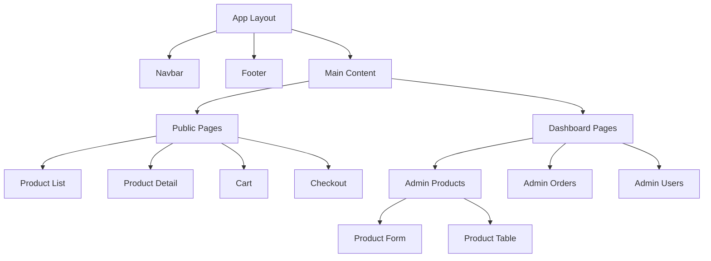
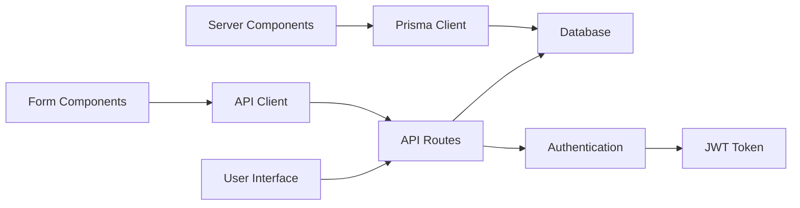

# Project Structure and Relationships Guide

## Directory Tree Structure
```
digital-ecomm/
├── app/                      # Next.js 14 App Router Directory
│   ├── api/                 # API Routes
│   │   ├── auth/           # Authentication endpoints
│   │   ├── products/       # Product management endpoints
│   │   └── users/          # User management endpoints
│   ├── dashboard/          # Admin dashboard pages
│   │   ├── products/       # Product management UI
│   │   ├── orders/         # Order management UI
│   │   └── users/          # User management UI
│   └── (site)/             # Public-facing pages
│       ├── products/       # Product listing/details
│       ├── cart/           # Shopping cart
│       └── checkout/       # Checkout process
│
├── components/              # Reusable UI Components
│   ├── ui/                # Base UI components
│   │   ├── button.tsx
│   │   ├── input.tsx
│   │   └── ...
│   ├── forms/            # Form components
│   │   ├── product-form.tsx
│   │   └── ...
│   └── shared/           # Shared components
│       ├── navbar.tsx
│       └── footer.tsx
│
├── lib/                    # Utility Functions & Core Logic
│   ├── utils/            # Helper functions
│   ├── api-client.ts     # API client functions
│   └── auth.ts           # Authentication logic
│
├── prisma/                 # Database Schema & Migrations
│   ├── schema.prisma     # Database schema
│   └── migrations/       # Database migrations
│
└── public/                 # Static Assets
    ├── images/
    └── icons/
```

## Component Relationships Diagram


## Data Flow Diagram


## Key Folder Roles and Responsibilities

### 1. `app/` Directory
- **Role**: Core application routing and pages
- **Responsibilities**:
  - ➤ Handles routing via file-system based routing
  - ➤ Contains all page components
  - ➤ Manages API routes
  - ➤ Implements server-side rendering logic

### 2. `components/` Directory
- **Role**: Reusable UI components
- **Responsibilities**:
  - ➤ Houses all shared components
  - ➤ Maintains consistent UI patterns
  - ➤ Provides form components
  - ➤ Contains layout components

### 3. `lib/` Directory
- **Role**: Core business logic and utilities
- **Responsibilities**:
  - ➤ Handles API interactions
  - ➤ Manages authentication
  - ➤ Provides utility functions
  - ➤ Contains type definitions

### 4. `prisma/` Directory
- **Role**: Database management
- **Responsibilities**:
  - ➤ Defines database schema
  - ➤ Manages migrations
  - ➤ Contains seed data
  - ➤ Handles database relationships

## Inter-Component Communication

### 1. Props Flow
```typescript
// Parent -> Child Communication
ParentComponent
  └─► ChildComponent (via props)
      └─► GrandchildComponent (via props)
```

### 2. Context Flow
```typescript
// Global State Management
AuthContext
  └─► Protected Routes
      └─► Admin Components
          └─► User Management

CartContext
  └─► Product Pages
      └─► Cart Components
          └─► Checkout Flow
```

## API Integration Points

### 1. Server Components
```typescript
// Direct Database Access
Server Component ──► Prisma Client ──► Database
```

### 2. Client Components
```typescript
// API Route Access
Client Component ──► API Client ──► API Routes ──► Database
```

## State Management Flow

### 1. Server State
```
React Query
  └─► API Endpoints
      └─► Database Operations
```

### 2. Client State
```
React Context
  └─► Global UI State
      └─► Component State
```

## Security Layer Integration

### 1. Authentication Flow
```
Login Form ──► Auth API ──► JWT Token
     ▲                         │
     └─────────────────────────┘
         Token Refresh Flow
```

### 2. Authorization Flow
```
Protected Route ──► Auth Middleware ──► Resource Access
     │                  │                    │
     └──── Denied ◄─────┘                   │
            Access                      Granted
                                       Access
```

## Development Workflow

### 1. Feature Development
```
New Feature Branch
  └─► Component Development
      └─► API Integration
          └─► Testing
              └─► Pull Request
```

### 2. Deployment Flow
```
Main Branch
  └─► Build Process
      └─► Testing
          └─► Deployment
              └─► Monitoring
```

## Common Patterns and Best Practices

### 1. Component Organization
- Keep components small and focused
- Use composition over inheritance
- Implement proper prop typing
- Follow naming conventions

### 2. State Management
- Use server components when possible
- Implement proper loading states
- Handle errors gracefully
- Cache API responses

### 3. Performance Optimization
- Implement proper code splitting
- Use image optimization
- Implement proper caching
- Monitor bundle size

## Troubleshooting Guide

### 1. Component Issues
- Check prop types
- Verify component rendering
- Check context providers
- Validate data flow

### 2. API Issues
- Verify API endpoints
- Check authentication
- Validate request data
- Monitor API responses

### 3. Database Issues
- Check schema changes
- Verify migrations
- Monitor connections
- Handle errors properly
